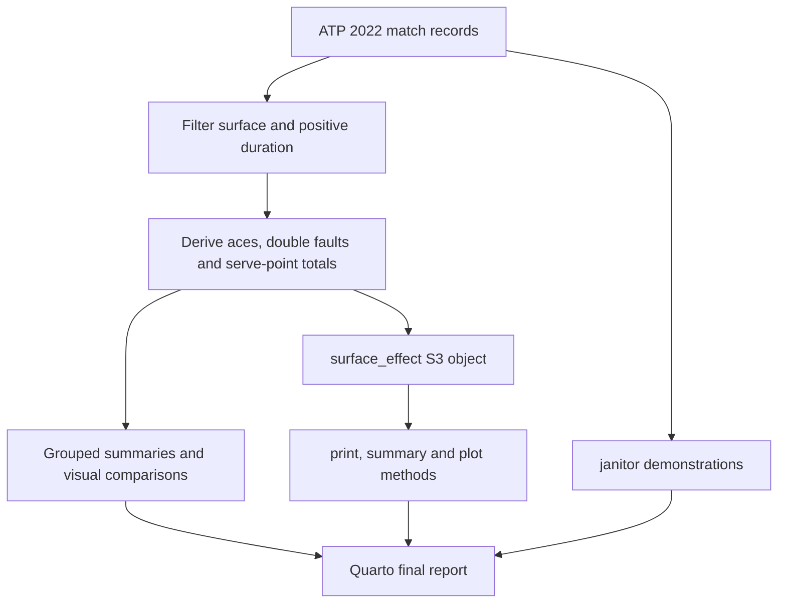

# Tennis Court Surface Analysis in R

**Exploring match duration and serve performance in 2022 ATP Challenger and qualifying matches.**

[Read the final report](reports/STAT40730_Final_Project_JamesMcClatchie.pdf) · [Explore the S3 implementation](R/surface_effect.R) · [Code provenance](docs/PROVENANCE.md)

An individual project by **James McClatchie** for **STAT40730 — Data Programming with R**, University College Dublin.

## The question

How does court surface relate to match duration, aces and double faults in ATP Challenger and qualifying matches?

The project combines exploratory analysis with reusable R programming: cleaning match records, comparing distributions, demonstrating `janitor`, and implementing a custom S3 class with `print()`, `summary()` and `plot()` methods.

## Project at a glance

| Component | Scope |
|---|---|
| Input | 10,016 match records and 49 variables |
| Duration analysis | 9,668 matches with a non-missing surface and positive duration |
| Ace-rate analysis | 9,615 complete observations |
| Groups | Clay, Hard, Grass and Carpet |
| Tools used in the report | R, tidyverse, dplyr, readr, purrr, ggplot2, janitor and Quarto |
| Programming focus | Input validation, functional programming and custom S3 methods |

> **Repository status:** The original 29-page PDF is included. The S3 implementation has been transcribed from its printed code; the example runner is a separately identified companion. The original Quarto source and input CSV have not yet been recovered. Results below are reported results, not a fresh rerun.

## Workflow



## Three parts of the project

### 1. Exploratory analysis

Import the match data, filter incomplete/invalid duration records, derive match-level serve measures and compare surfaces using grouped summaries, histograms, boxplots and surface-by-round counts. `purrr::map_dfr()` applies the same summary logic across multiple numeric variables.

### 2. Data inspection with janitor

Demonstrate the existing package's `clean_names()`, `tabyl()` and `get_dupes()` functions, alongside table-formatting helpers. Repeated values of `minutes` are treated as shared match durations, not proof of duplicate match records.

### 3. Reusable S3 programming

`surface_effect()` validates the supplied data and column names, checks that the response is numeric, optionally drops missing values, summarises each group and optionally runs a Kruskal–Wallis test. It returns a classed list with separate methods for a concise overview, detailed statistics and visual comparison.

```r
source("R/surface_effect.R")

# `matches` is the prepared match-level data frame.
result <- surface_effect(matches, response = "minutes")
print(result)
summary(result)
plot(result)

# Reuse the same interface for another numeric outcome.
ace_result <- surface_effect(matches, response = "aces_per_svpt")
summary(ace_result)
```

This is a reusable analysis class, not a packaged CRAN library. `janitor` is an existing third-party package used in the project.

## Reported findings

| Surface | Duration-analysis matches | Mean duration, minutes | Mean aces per match | Mean match-level ace rate |
|---|---:|---:|---:|---:|
| Clay | 4,907 | ≈104 | 5.74 | 4.07% |
| Hard | 4,369 | ≈100 | 10.4 | 7.30% |
| Grass | 343 | 96.6 | 12.1 | 8.26% |
| Carpet | 49 | 89.6 | 21.1 | 14.5% |

Values are rounded as printed in the report. Serve statistics use available observations; the duration counts are not their denominators. Ace-rate sample sizes are 4,905 Clay, 4,319 Hard, 342 Grass and 49 Carpet. The ace rate is the mean of per-match ratios, not a pooled ratio of all aces to all serve points.

- Clay matches had the longest mean duration and lowest mean ace rate in this sample.
- Carpet had the shortest mean duration and highest mean ace rate, but only 49 matches were available.
- Mean total double faults were similar across surfaces (approximately 5.77–6.29 per match); this is descriptive, not proof of equivalent rates.
- The reported duration Kruskal–Wallis result was **H = 52.14382**, **df = 3**, **p ≈ 2.79 × 10⁻¹¹**.
- The ace-rate test returned **H = 2,122.437**, **df = 3**; the printed p-value of `0` reflects numerical underflow, not a literally zero probability.

## Interpretation and limitations

These are unadjusted associations in one season. Surface groups are highly imbalanced, and the analysis does not adjust for player ability, repeated players, tournament context or retirements. Positive duration alone does not identify completed matches. Kruskal–Wallis tests are omnibus comparisons; they do not establish which pairs differ or that surface causes the observed differences. Repeated player appearances also challenge the independence assumption.

Statistical significance is not an effect-size estimate. The function name `surface_effect` describes its grouping interface, not a causal model. See [method notes](docs/METHOD_NOTES.md) for the original implementation's boundaries.

## Run the available code

Use R 4.1 or later (the code uses the native pipe). From R in the repository root:

```r
install.packages(c("dplyr", "ggplot2", "readr"))
source("R/surface_effect.R")
```

To run the companion example, place the original CSV at `data/atp_matches_qual_chall_2022.csv`, then run:

```r
source("examples/run_surface_comparison.R")
```

The full assessed workflow also used `tidyverse`, `purrr` and `janitor`. Exact original package versions were not recorded in the supplied PDF. The original `.qmd` is needed to re-render the assessed report; the PDF alone is not a complete reproducibility bundle.

## Repository contents

| Path | Purpose |
|---|---|
| `reports/` | Original submitted PDF, preserved unchanged |
| `R/surface_effect.R` | S3 function and methods transcribed from report pages 21–24 |
| `examples/run_surface_comparison.R` | Newly added runner for the original CSV |
| `data/README.md` | Expected data filename, fields and availability |
| `docs/PROVENANCE.md` | What is original, transcribed or newly added |
| `docs/METHOD_NOTES.md` | Interpretation and implementation caveats |

## Authorship and reuse

Original analysis and report: **James McClatchie**. Repository documentation and the example runner were prepared later with AI assistance; they are distinguished from assessed coursework in the provenance notes.

No reuse licence has been selected for the project code or report. Underlying data and third-party packages retain their own terms. The report contains its original bibliography.
